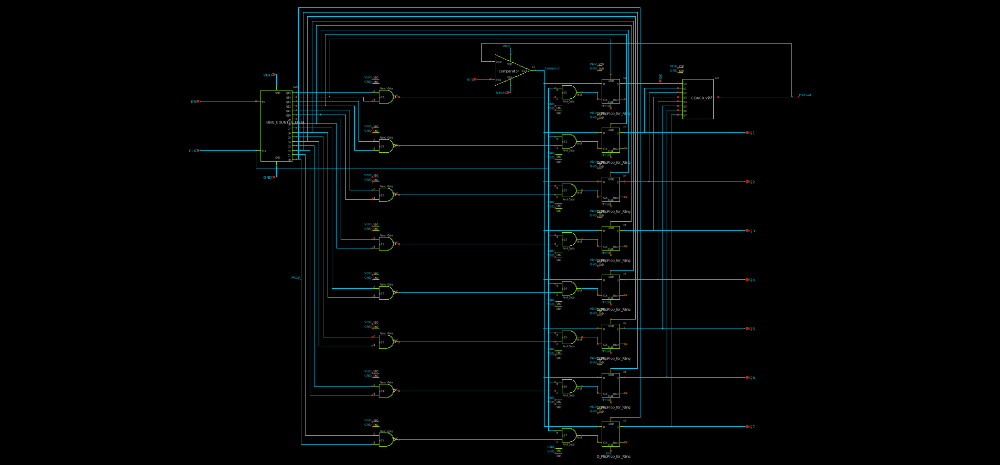
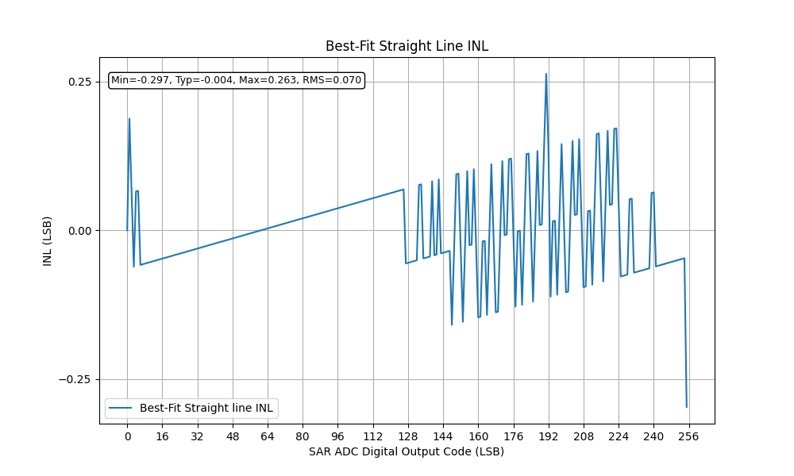
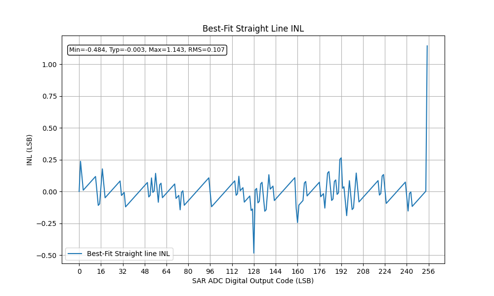
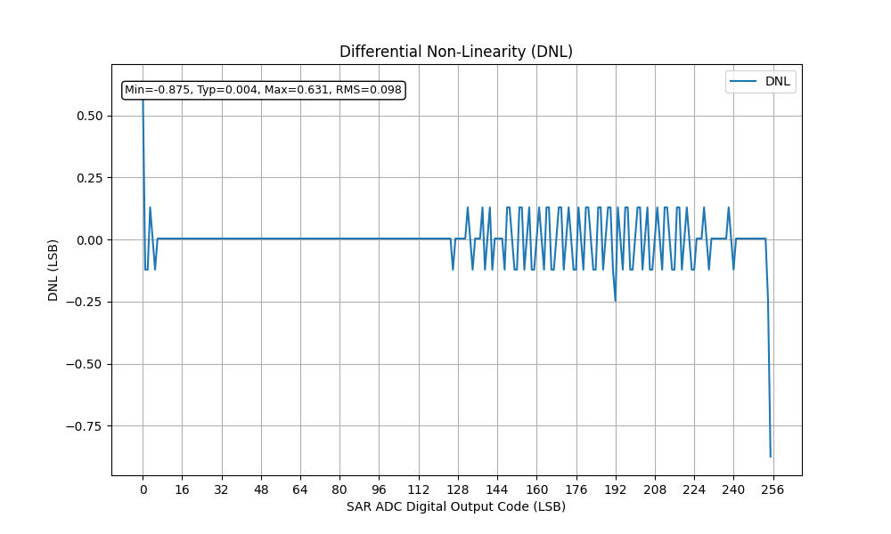
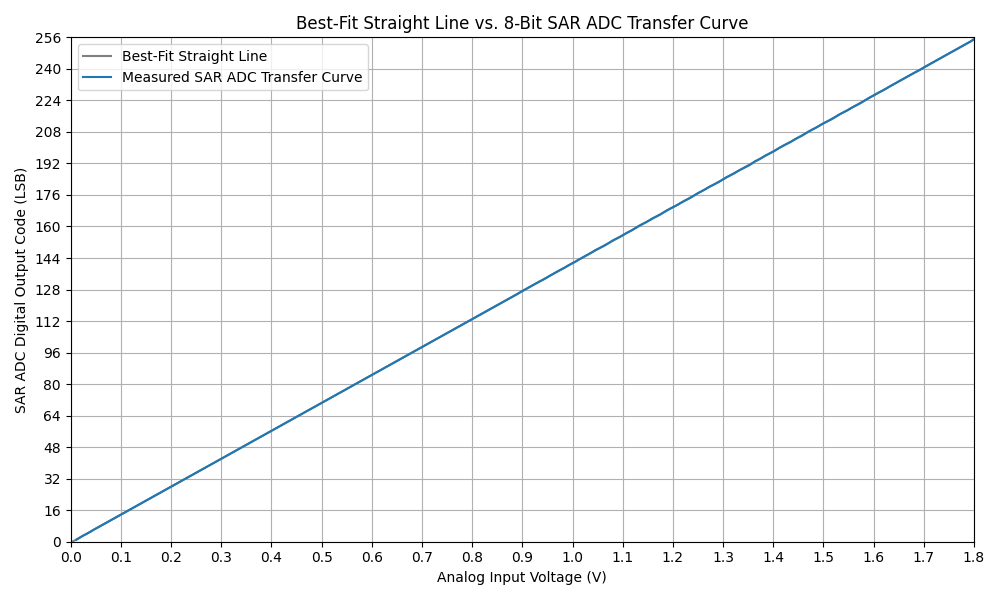
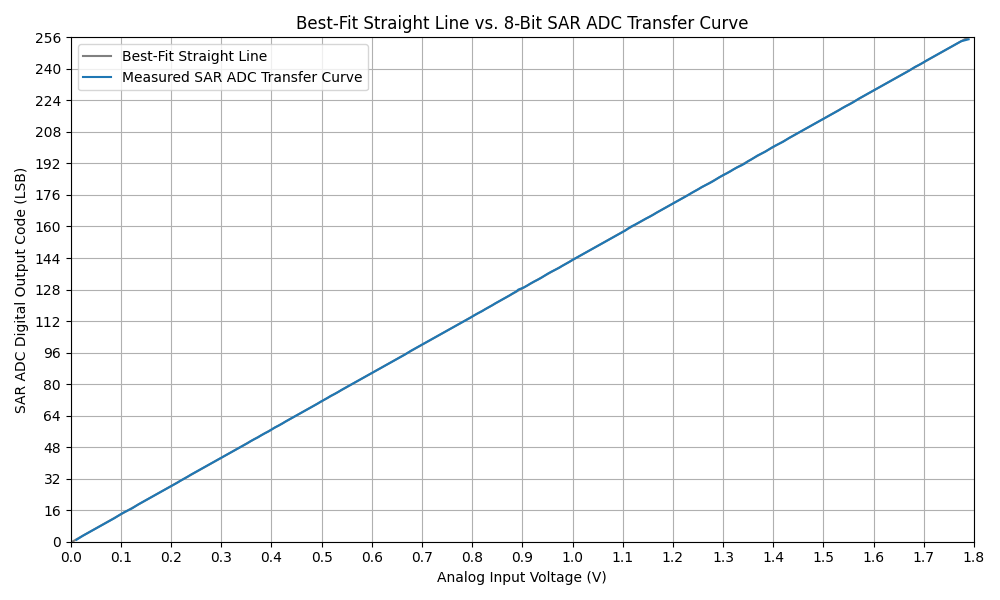

# SAR-ADC-using-Sky130-PDK (MICRO-1-2425-2)

## Overview
This project focuses on the design and implementation  Successive Approximation Register (SAR) Analog-to-Digital Converter (ADC) using the SkyWater 130nm (Sky130) PDK. The repository contains design files, simulation results, documentation, and other materials related to our thesis.

## Table of Contents
- [Overview](#overview)
- [Schematic](#schematic)
- [Layout](#layout)
- [Results Summary](#results-summary)
  - [Typical-Typical (tt)](#typical-typical-tt)
  - [Slow-Slow (ss)](#slow-slow-ss)
  - [Fast-Slow (fs)](#fast-slow-fs)
  - [Slow-Fast (sf)](#slow-fast-sf)
  - [Fast-Fast (ff)](#fast-fast-ff)
  - [INL Graphs (Typical-Typical Corner)](#inl-graphs-typical-typical-corner)
  - [DNL Graphs (Typical-Typical Corner)](#dnl-graphs-typical-typical-corner)
  - [Best-Fit Straight Line vs. SAR ADC Transfer Curve (Typical-Typical Corner)](#best-fit-straight-line-vs-sar-adc-transfer-curve-typical-typical-corner)
- [Data](#data)
- [Python/MATLAB Codes Used for Computation](#pythonmatlab-codes-used-for-computation)
- [Contributors](#contributors)

## Schematic

  

- [Open in Xschem Viewer](https://xschem-viewer.com/?file=https://raw.githubusercontent.com/issastrt/SAR-ADC-using-Sky130-PDK/main/xschem/SAR-ADC-using-Sky130-PDK.sch)

## Layout

  

- [Parasitic Netlist](netlist/rcx/SAR-ADC-using-Sky130-PDK.spice) — extracted netlist from the layout including parasitics, used for post-layout simulations.

## Results Summary

### Typical-Typical (tt)

| Parameter            | Pre-layout (min) | Pre-layout (typ) | Pre-layout (max) | Post-layout (min) | Post-layout (typ) | Post-layout (max) |
|----------------------|------------------|------------------|------------------|-------------------|-------------------|-------------------|
| Power Consumption (mW) | 0.4224 | 0.4532 | 0.4747 | 0.4683 | 0.50205 | 0.5309 |
| Sampling Rate (kS/s)   | 117.351 | 117.357 | 117.362 | 117.243 | 117.2465 | 117.260 |
| Offset Error (LSB)     | –      | 0.638  | –      | –       | 0.638  | –       |
| INL (LSB)              | -0.287 | -0.004 | 0.263  | -0.484  | -0.003 | 1.143  |
| DNL (LSB)              | -0.875 | 0.004  | 0.631  | -0.355  | 0.004  | 1.133  |
| SNDR (dB)              | –      | 48.148 | –      | –       | 47.2922| –      |
| ENOB (bits)            | –      | 7.7057 | –      | –       | 7.5635 | –      |
| Walden FOM (fJ/conv-step) | –   | 18453  | –      | –       | 22637  | –      |
| Schreier FOM (dB)      | –      | 129.2806 | –    | –       | 127.9654 | –    |

---

### Slow-Slow (ss)

| Parameter            | Pre-layout (min) | Pre-layout (typ) | Pre-layout (max) | Post-layout (min) | Post-layout (typ) | Post-layout (max) |
|----------------------|------------------|------------------|------------------|-------------------|-------------------|-------------------|
| Power Consumption (mW) | 0.3866 | 0.4195 | 0.4380 | 0.432  | 0.4640 | 0.4920 |
| Sampling Rate (kS/s)   | 117.264 | 117.341 | 117.352 | 117.161 | 117.2025 | 117.234 |
| Offset Error (LSB)     | –      | 0.638  | –      | –       | 0.780  | –       |
| INL (LSB)              | -0.305 | -0.004 | 0.391  | -0.265  | -0.020 | 1.121  |
| DNL (LSB)              | -0.875 | 0.004  | 0.631  | -0.565  | 0.004  | 1.133  |
| SNDR (dB)              | –      | 47.8336| –      | –       | 44.6390| –      |
| ENOB (bits)            | –      | 7.6534 | –      | –       | 7.1228 | –      |
| Walden FOM (fJ/conv-step) | –   | 17711  | –      | –       | 28407  | –      |
| Schreier FOM (dB)      | –      | 129.3018 | –    | –       | 125.6529 | –    |

---

### Fast-Slow (fs)

| Parameter            | Pre-layout (min) | Pre-layout (typ) | Pre-layout (max) | Post-layout (min) | Post-layout (typ) | Post-layout (max) |
|----------------------|------------------|------------------|------------------|-------------------|-------------------|-------------------|
| Power Consumption (mW) | 0.4160 | 0.4530 | 0.4730 | 0.464  | 0.504  | 0.532  |
| Sampling Rate (kS/s)   | 117.310 | 117.321 | 117.321 | 117.187 | 117.190 | 117.205 |
| Offset Error (LSB)     | –      | 0.780  | –      | –       | 0.780  | –       |
| INL (LSB)              | -0.298 | -0.003 | 0.415  | -0.302  | -0.010 | 1.142  |
| DNL (LSB)              | -0.875 | 0.004  | 0.882  | -0.247  | 0.004  | 1.133  |
| SNDR (dB)              | –      | 48.4861| –      | –       | 47.1004| –      |
| ENOB (bits)            | –      | 7.7618 | –      | –       | 7.5316 | –      |
| Walden FOM (fJ/conv-step) | –   | 17741  | –      | –       | 23243  | –      |
| Schreier FOM (dB)      | –      | 129.6207 | –    | –       | 127.7547 | –    |

---

### Slow-Fast (sf)

| Parameter            | Pre-layout (min) | Pre-layout (typ) | Pre-layout (max) | Post-layout (min) | Post-layout (typ) | Post-layout (max) |
|----------------------|------------------|------------------|------------------|-------------------|-------------------|-------------------|
| Power Consumption (mW) | 0.429  | 0.4535 | 0.482  | 0.480  | 0.507  | 0.535  |
| Sampling Rate (kS/s)   | 117.367 | 117.370 | 117.377 | 117.571 | 117.6255 | 117.649 |
| Offset Error (LSB)     | –      | 0.496  | –      | –       | 0.496  | –       |
| INL (LSB)              | -1.002 | 0.027  | 0.378  | -0.780  | 0.010  | 0.759  |
| DNL (LSB)              | -0.297 | 0.004  | 0.380  | -0.937  | 0.004  | 1.510  |
| SNDR (dB)              | –      | 47.3454| –      | –       | 44.4454| –      |
| ENOB (bits)            | –      | 7.5723 | –      | –       | 7.0906 | –      |
| Walden FOM (fJ/conv-step) | –   | 20254  | –      | –       | 31625  | –      |
| Schreier FOM (dB)      | –      | 128.4751 | –    | –       | 125.0900 | –    |

---

### Fast-Fast (ff)

| Parameter            | Pre-layout (min) | Pre-layout (typ) | Pre-layout (max) | Post-layout (min) | Post-layout (typ) | Post-layout (max) |
|----------------------|------------------|------------------|------------------|-------------------|-------------------|-------------------|
| Power Consumption (mW) | 0.462  | 0.487  | 0.509  | 0.522  | 0.5475 | 0.578  |
| Sampling Rate (kS/s)   | 117.360 | 117.361 | 117.394 | 117.289 | 117.293 | 117.317 |
| Offset Error (LSB)     | –      | 0.638  | –      | –       | 0.638  | –       |
| INL (LSB)              | -0.297 | -0.002 | 0.188  | -0.690  | -0.001 | 1.142  |
| DNL (LSB)              | -0.875 | 0.004  | 0.631  | -0.561  | 0.004  | 1.133  |
| SNDR (dB)              | –      | 48.4053| –      | –       | 44.6390| –      |
| ENOB (bits)            | –      | 7.7484 | –      | –       | 7.1228 | –      |
| Walden FOM (fJ/conv-step) | –   | 19251  | –      | –       | 33439  | –      |
| Schreier FOM (dB)      | –      | 129.2255 | –    | –       | 124.9376 | –    |

### INL Graphs (Typical-Typical Corner)

**Pre-layout**  

  

**Post-layout**  

  

Additional INL graphs for the other corners (SS, FS, SF, FF) are available in the [`data/dnl_&_inl/Graphs/INL/`](data/dnl_&_inl/Graphs/INL/) folder.

### DNL Graphs (Typical-Typical Corner)

**Pre-layout**  

  

**Post-layout**  

  

Additional DNL graphs for the other corners (SS, FS, SF, FF) are available in the [`data/dnl_&_inl/Graphs/DNL/`](data/dnl_&_inl/Graphs/DNL/) folder.

### Best-Fit Straight Line vs. SAR ADC Transfer Curve (Typical-Typical Corner)

**Pre-layout**  

  

**Post-layout**  

  

Additional transfer curve graphs for the other corners (SS, FS, SF, FF) are available in the [`data/dnl_&_inl/Graphs/TransferCurve/`](data/dnl_&_inl/Graphs/TransferCurve/) folder.

## Data

- [DRC Results](data/DRC%20Results.out) — report generated by Magic.  
- [LVS Results](data/LVS%20Results.out) — report generated by Netgen.  
- [Power Consumption Results](data/Power%20Consumption.xlsx)
- [Sampling Rate Results](data/Sampling%20Rate.xlsx)
- [Offset Error Results](data/Offset%20Error.xlsx)
- [Analog Input & Digital Output Data](data/dnl_&_inl/Pre%20&%20Post%20Layout,%20All%20Corners%20-%201_4th%20LSB%20Ramp%20Input%20Results.csv) — extracted data from all corners, used as the basis for generating INL and DNL.  
- [Generated INL & DNL Data](data/dnl_&_inl/) — computed INL and DNL results derived from the analog input and digital output data.  
- [SNDR, ENOB, and FOM Dataset](data/SNDR_ENOB_FOM_Data.csv) — extracted dataset used for calculating performance parameters.  
- [Minimum Temperature Results](data/temp/Min_Temperature_Results.csv)  
- [Maximum Temperature Results](data/temp/Max_Temperature_Results.csv)  

## Python/MATLAB Scripts Used for Computation

- [Power Consumption Calculation](cace/scripts/power_consumption.py)
- [Sampling Rate Calculation](cace/scripts/sampling_rate.py)
- [Offset Error Calculation](cace/scripts/offset_error.py)
- [Dataset Extraction for DNL](cace/scripts/dnl.py) and [INL](cace/scripts/inl.py)
- [INL & DNL Calculation](cace/scripts/DNL%20&%20INL%20Python%20Program.py)
- [SNDR/ENOB/FOM Dataset Extraction](cace/scripts/sndr_enob_fom.py)
- [SNDR, ENOB, and FOM Calculation](data/sndr_enob_fom_matlab.pdf)

## Contributors
- Daiz, Samantha Eureka
- Madrazo, Christian Mico A.
- Manahan, Audrey T.
- Sta Rita, Isabelle Rose A.  

All authors are BS Electronics Engineering students at **De La Salle University**.
