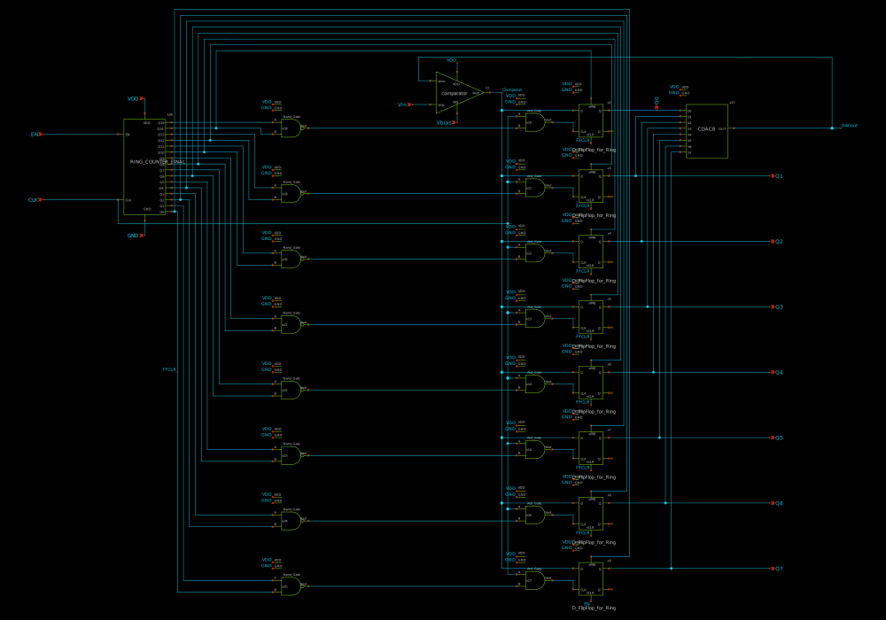

# SAR-ADC-using-Sky130-PDK

- Description: 8-bit SAR ADC with 3.3V supply and enable input
- Commit: N/A
- PDK: sky130A

## Authorship

- Designer: Tim Edwards
- Company: Efabless Corporation
- Created: November 21, 2023
- License: Apache 2.0
- Last modified: None

## Pins

- Q7:0
  + Description: Digital output (8 bits)
  + Type: digital
  + Direction: output
  + Vmin: GND - 0.3
  + Vmax: VDD + 0.3
- Vin
  + Description: ADC voltage input
  + Type: signal
  + Direction: input
  + Vmin: GND
  + Vmax: VDD
- VDD
  + Description: Positive digital power supply
  + Type: power
  + Direction: inout
  + Vmin: 1.7
  + Vmax: 1.9
- GND
  + Description: Analog ground
  + Type: ground
  + Direction: inout
  + Vmin: -0.1
  + Vmax: 0.1
- Vbias
  + Description: Voltage bias
  + Type: signal
  + Direction: input
  + Vmin: -0.9
  + Vmax: -0.7
- CLK
  + Description: Clock
  + Type: digital
  + Direction: input
  + Vmin: 0
  + Vmax: VDD
- EN
  + Description: Enable pin
  + Type: digital
  + Direction: input
  + Vmin: 0
  + Vmax: VDD

## Default Conditions

- VVDD
  + Description: Digital power supply voltage
  + Display: VDD
  + Unit: V
  + Typical: 1.8
- VVGND
  + Description: Digital ground
  + Display: VGND
  + Unit: V
  + Typical: 0
- VVbias
  + Description: Voltage bias
  + Display: Vbias
  + Unit: V
  + Typical: -0.8
- VCLK
  + Description: Clock
  + Display: CLK
  + Unit: V
  + Typical: 0
- VEN
  + Description: Enable pin
  + Display: EN
  + Unit: V
  + Typical: 1.8
- VVin
  + Description: Input voltage
  + Display: Vin
  + Unit: V
  + Minimum: 0
  + Typical: 0.9
  + Maximum: 1.8
- Rout
  + Description: Output load resistance
  + Display: RLoad
  + Unit: MΩ
  + Typical: 100
- Cout
  + Description: Output load capacitance
  + Display: CLoad
  + Unit: fF
  + Maximum: 100
- temperature
  + Description: Ambient temperature
  + Display: Temp
  + Unit: °C
  + Minimum: -40
  + Typical: 27
  + Maximum: 130
- corner
  + Description: Process corner
  + Display: Corner
  + Minimum: ss
  + Typical: tt
  + Maximum: ff

## Symbol

## Schematic

## Layout

