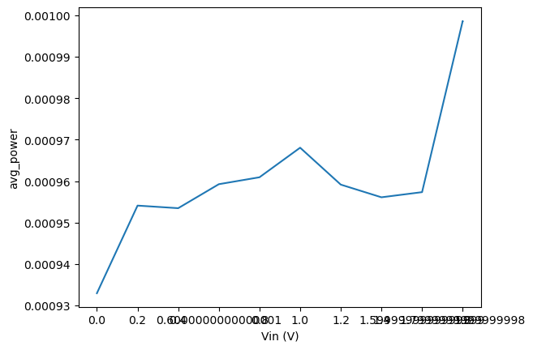

# CACE Summary for SAR-ADC-using-Sky130-PDK

**netlist source**: schematic

|      Parameter       |         Tool         |     Result      | Min Limit  |  Min Value   | Typ Target |  Typ Value   | Max Limit  |  Max Value   |  Status  |
| :------------------- | :------------------- | :-------------- | ---------: | -----------: | ---------: | -----------: | ---------: | -----------: | :------: |
| Average Power        | ngspice              | avg_power            |             any |   0.988 mW |          any |   1.003 mW |          any |   1.059 mW |   Pass ✅    |

## Plots

## power

