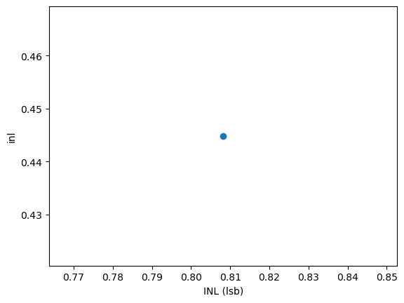

# CACE Summary for SAR-ADC-using-Sky130-PDK

**netlist source**: schematic

|      Parameter       |         Tool         |     Result      | Min Limit  |  Min Value   | Typ Target |  Typ Value   | Max Limit  |  Max Value   |  Status  |
| :------------------- | :------------------- | :-------------- | ---------: | -----------: | ---------: | -----------: | ---------: | -----------: | :------: |
| INL                  | ngspice              | inl                  |          -1 lsb |  0.445 lsb |        0 lsb |  0.445 lsb |      1.5 lsb |  0.445 lsb |   Pass ✅    |

## Plots

## inl

