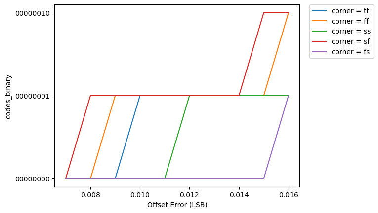

# CACE Summary for SAR-ADC-using-Sky130-PDK

**netlist source**: schematic

|      Parameter       |         Tool         |     Result      | Min Limit  |  Min Value   | Typ Target |  Typ Value   | Max Limit  |  Max Value   |  Status  |
| :------------------- | :------------------- | :-------------- | ---------: | -----------: | ---------: | -----------: | ---------: | -----------: | :------: |
| Offset Error         | ngspice              | offset_error         |             any |  0.638 LSB |          any |  0.922 LSB |          any |  1.776 LSB |   Pass ✅    |

## Plots

## offset_error

