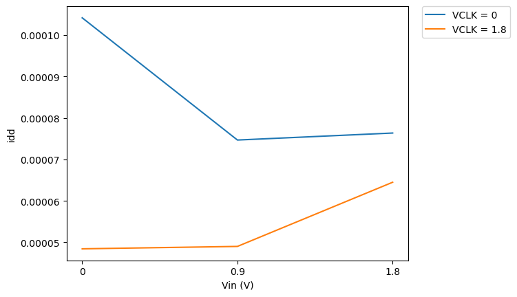
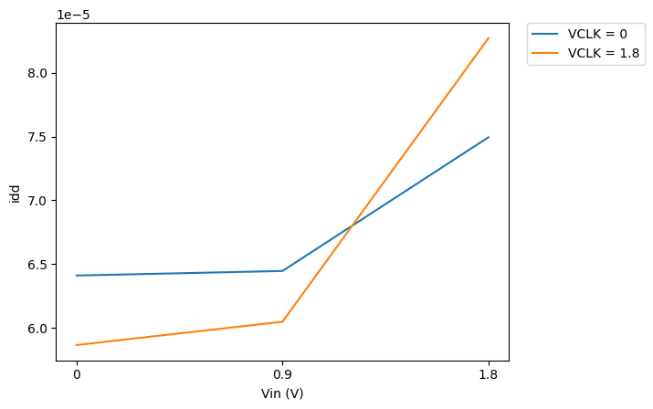

# CACE Summary for SAR-ADC-using-Sky130-PDK

**netlist source**: schematic

|      Parameter       |         Tool         |     Result      | Min Limit  |  Min Value   | Typ Target |  Typ Value   | Max Limit  |  Max Value   |  Status  |
| :------------------- | :------------------- | :-------------- | ---------: | -----------: | ---------: | -----------: | ---------: | -----------: | :------: |
| Idd                  | ngspice              | idd                  |             any |  48.435 uA |       170 uA |  68.797 uA |       250 uA | 105.635 uA |   Pass ✅    |
| Idd_disabled         | ngspice              | idd                  |             any |  58.657 uA |       170 uA |  64.285 uA |       250 uA |  82.711 uA |   Pass ✅    |

## Plots

## idd_enabled

## idd_disabled

